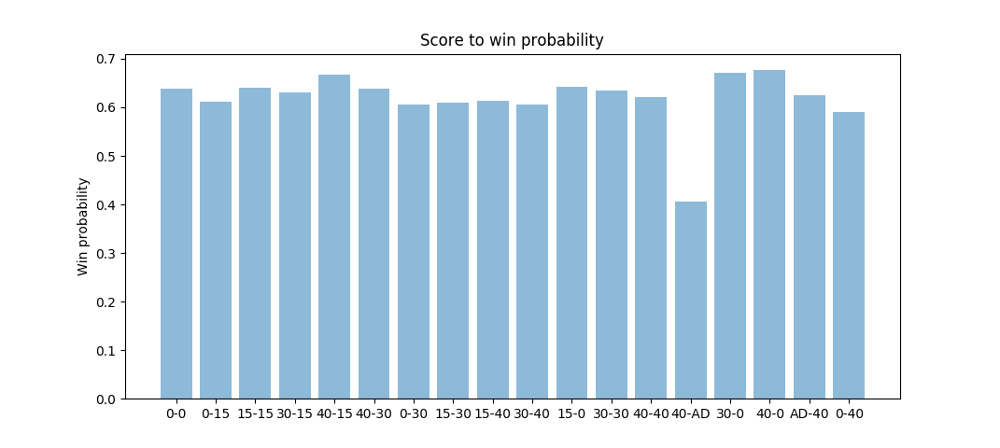

# tennis

Jeff Sackmann has tons of open-source data about professional tennis on [his GitHub account](https://github.com/JeffSackmann).  Not only does he have a bunch of unanswered [questions about tennis](https://github.com/JeffSackmann/tennis_Research_Notes), I have a few of my own.

As an avid tennis player, I am both motivated to tackle this data and equipped to interpret results in an insightful way.

## Preliminary questions and analysis

### Question 1

Tennis is a mental game.  Can the current score within a game predict outcome?  When I watch tennis on TV, I notice that a score of 0-30 or 15-30 almost always results in the server winning the next point.  Am I correct or crazy?

The data says that I'm crazy!  But it also points out a surprising result.  Servers in the 40-AD situation are much more likely to lose the next point!

The interesting thing about this is that the 40-AD score and the 30-40 score are arguably identical situations.  Both scores result in losing the game if the next point is lost, and both scores result in 40-40 if the next point is won.  But the data shows that these situations are psychologically different.  Servers in the 40-AD position have been serving for a longer amount of time and weren't able to close out the game sooner.  Returners in that position may be tough-customers who are chomping at the bit to steal the game from the server.

When I initially ran this graph, I only ran it on the first 200 data points.  The results were very different:

These results seem to confirm my suspicion for servers reacting strongly to a 0-30 situation.  It turns out that the first 200 data points correspond to a match between Sam Querrey and Kevin Anderson.  Sam Querrey is a very strong server.  Is it possible that this correlation holds for strong servers in general?  Can we find more patterns if we cluster our players into different categories?  This leads into the next question.

### Question 2

Do players cluster into nice 'player types', and are certain player clusters more successful?

For example, I predict that a heavier player is more likely to have a heavier racket and a one-handed backhand.  On the other hand, I predict a lighter player will have a two-handed backhand, be a faster runner and a better returner, and have a weaker serve.

Am I correct about the existance of these two clusters?  Are there more clusters?  There are many dimensions to consider, including weight, height, lefty/righty, one-handed-backhand/two-handed-backhand, racket weight, and racket string-pattern.  These dimensions can be split into two categories: the "independent" dimensions (like height) that are outside of the player's control, and the "dependent" dimensions (like racket string-pattern) that are the player's choice.

### Question 3

Is there a correlation between different player types / play styles and the types of injuries that those players get?  What exactly are those correlations?  I will probably not pursue this question because I have yet to find good data on tennis injuries.

### Question 4

Are serve-and-volleyers streakier than others?  This question was posed by Jeff Sackman in his [questions about tennis](https://github.com/JeffSackmann/tennis_Research_Notes).  This question may be easy to answer because it uses a lot of the same machinery as the score calculation above.

