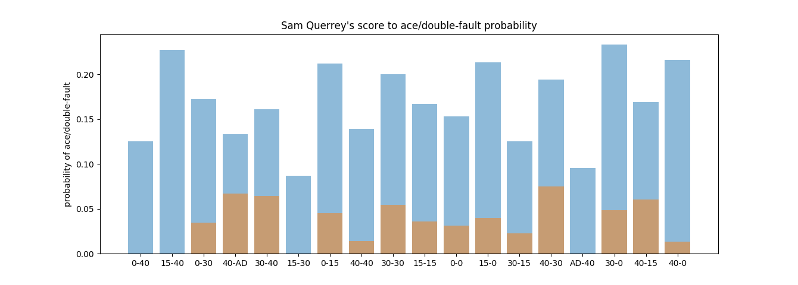

# tennis

## Run dev server

  docker build -t mvlancellotti/tennis-backend . &&
  docker run -p 5000:5000 -v $(pwd):/home/jovyan/work mvlancellotti/tennis-backend

## Test and prod server

  docker build -t mvlancellotti/tennis-backend . &&
  docker run -p 5000:5000 mvlancellotti/tennis-backend

[video proposal here](https://www.youtube.com/embed/c3c2JLGioNc)

Jeff Sackmann has tons of open-source data about professional tennis on [his GitHub account](https://github.com/JeffSackmann).  Not only does he have a bunch of unanswered [questions about tennis](https://github.com/JeffSackmann/tennis_Research_Notes), I have a few of my own.

As an avid tennis player, I am both motivated to tackle this data and equipped to interpret results in an insightful way.

## Preliminary questions and analysis

### Question 1

Tennis is a mental game.  Can the current score within a game predict outcome?  When I watch tennis on TV, I notice that a score of 0-30 or 15-30 almost always results in the server winning the next point.  Am I correct or crazy?

(Data from `charting-m-points.csv` from the [Match Charting Project](https://github.com/JeffSackmann/tennis_MatchChartingProject) which lists about 300,000 tennis points coming from about 2,000 men's matches.  If you are not familiar with tennis scoring, read [here](https://github.com/MareoRaft/appendix.md).)

The data says that I'm crazy!  But it also points out a surprising result.  The 40-AD score is the situation where servers are most likely to lose the next point.  A Chi-squared test confirms significance with a p-value of order 10^(-13).

The interesting thing about this is that the 40-AD score and the 30-40 score are arguably identical situations.  Both scores result in losing the game if the next point is lost, and both scores result in 40-40 if the next point is won.  But the data shows that these situations are psychologically different.  Servers in the 40-AD position have been serving for a longer amount of time and weren't able to close out the game sooner.  Returners in that position may be tough-customers who are chomping at the bit to steal the game from the server.

Where things get really interesting is when we look at the stats for a specific player (Sam Querrey):

These results seem to confirm my suspicion for servers reacting strongly to a 0-30 situation (but is inconclusive with a Chi-squared test p-value of 0.09) despite much lower outcomes for similar scores such as 15-30 and 15-40.  Sam Querrey is a very strong server.  Is it possible that this correlation holds for strong servers in general?  Can we find more patterns if we cluster our players into different categories?

### Question 2

Are breaks more frequent immediately after winning a set?  This question was posed by Jeff Sackman in his [questions about tennis](https://github.com/JeffSackmann/tennis_Research_Notes).  One might think 'yes' because of the momentum from winning the set, but there are many factors to consider.  To answer the question, I examined four categories:

  1. Probability of any returner breaking the server: 0.214.
  2. Probability of previous-game-winning returner breaking the server: 0.170.
  3. Probability of any returner breaking the server in first game of set: 0.227.
  4. Probability of previous-set-winning returner breaking the server in first game of set: 0.255.

Considering the large number of data points, this is statistically significant.  We see that (1) and (3) are close to each other, which suggests that being at the beginning of a set itself does not increase the probability of breaking by much.  Therefore, the value for situation (4) means that players *really do get 'momentum'* from their set win!  But what is most surprising is the **very low value for (2)**.  In situation (2), the player has just successfully held their serve, and they are *less* likely to break in the next game than even the average probability (1).  I believe this is because the player has expended more energy to hold their serve, and now the pressure is lifted from them in the following game.

### Question 3

Going back to the "score to win-next-point" analysis and the thought that certain types of players (such as the "big server" Sam Querrey) may behave differently in certain situations, it gave me the idea to run a "score to ace" analysis in much the same way.

The results are again quite interesting.  Looking at all the matches,

there is a correlation between aces and the scores 30-0, 40-0, and 40-15.  This suggests that when the server is ahead, he is confident, more willing to take risks, and more likely ace.  (A Chi-squared test on the 40-0 situation confirms with a p-value of order 10^(-107).)

Now, zooming in on Sam Querrey's service points, we have some similarities and differences:

Aces are shown in blue and double-faults are superimposed in brown.

This time, there is a surprisingly high probability for aces at 15-40, but no double-faults, which suggests that Querrey reacts well to this pressure situation.  At the other end of the spectrum, Querrey hits many less aces in the 40-AD situation and many more double-faults.  This suggests that he is much more nervous.

## Proposal

I would like to answer as many as Jeff Sackman's questions as possible, writing up the work clearly and ultimately contributing to his project.

## Does winning a very long game (e.g. a game with 6+ deuces) influence the outcome of the next game, or represent some more general momentum shift?

We'll look at games with 4 or more deuces.  We'll see if the server won that game.  Then we'll see if the server wins his next service game (2 games later).  For comparison, let's actually look at four situations:

  1. A server wins the game.
  2. A server loses the game.
  3. A server faces 4+ deuces and wins the game.
  4. A server faces 4+ deuces and loses the game.

For each of the four situations, we observe how often (as a percentage) the server wins his next service game.

Without looking at the data, many deuces indicates to me that the server is struggling.  I predict that the 4+ deuce categories will both be lower than the control categories.  I also predict that the win categories will be higher than the lose categories.

The data is in!  Servers in the 4+ deuce situation win the game 69.2% of the time.  In general, servers win the game 78.4% of the time, which seems to confirm my prediction.  Now for the four categories:

  1. The server wins the game: 76.9%
  2. The server loses the game: 67.6%
  3. 4+ deuces, server wins game: 72.0%
  4. 4+ deuces, server loses game: 66.8%

The deuce situations are worse that the normal situations, as predicted.  The winning situations are much higher than the losing situations, which makes sense (because winners tend to win).  We conclude that the *result* of long deuce games does *not* have a major impact on future outcomes.  However, the very *presence* of long deuce games is an indicator that the server will perform worse.

