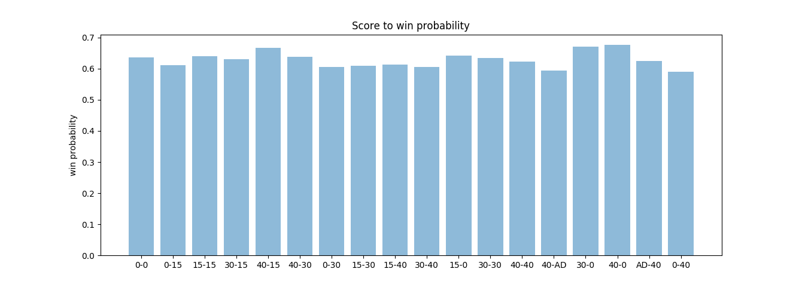

In the bar graph below, each bar corresponds to a score.  The server's score is show first followed by a dash followed by the receiver's score.  In tennis, the scores you obtain are 0, 15, 30, 40, in that order.  If the score reaches 40-40, then it is required to win by two points.  Hence AD-40 means that the server is one point ahead and on the verge of winning, and 40-AD means that the receiver is one point ahead and on the verge of winning.  The vertical axis of the graph represents the probability that the server will win the point, which is always a value between 0 and 1.

